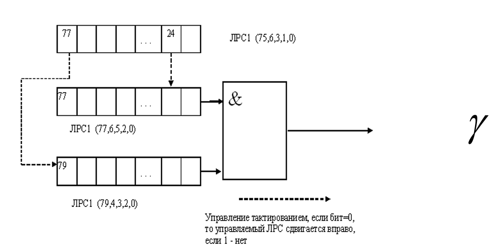

# Лабораторная работа № 3 Поточное симметричное шифрование

**Цель работы**: изучение структуры и основных принципов работы
современных алгоритмов поточного симметричного шифрования,
приобретение навыков программной реализации поточных симметричных
шифров.

**Порядок выполнения работы**

1. Ознакомьтесь с теоретическими основами шифрования данных, которые приведены в [1] и [2].
2. Получите вариант задания у преподавателя.
3. Напишите программу согласно варианту задания.
4. Отладьте разработанную программу и покажите результаты работы программы преподавателю.
5. Составьте отчет по лабораторной работе

**Содержание отчета**

Отчет по лабораторной работе должен содержать следующие
сведения:
- название и цель работы;
- вариант задания;
- листинг разработанной программы с комментариями;
- результаты работы программы.

**Варианты  заданий**

см. [задачник](../docs/1730_Ozhiganow.pdf)

**Контрольные вопросы**

1. Какие методы формирования потока ключей для поточных шифров вам известны?
2. Что такое регистр сдвига с линейной обратной связью?
3. Каков критерий оптимальности структуры регистра сдвига с линейной обратной
   связью?
4. Для чего регистры сдвига с линейной обратной связью объединяют в нелинейные
   схемы подключения?
5. Что такое проблемы линейной сложности и корреляционной связи схем,
   использующих сдвиговые регистры с линейной обратной связью?
6. Объясните принцип работы сдвигового регистра с обратной связью по переносу.
7. Каков критерий оптимальности структуры регистра сдвига с обратной связью по
   переносу?

- - -

# Комментарии

Мой вариант:

> 3. Реализовать в программе поточное кодирование текста, вводимого с
>    клавиатуры, с помощью заданной нелинейной схемы РС.

Задание понимать можно так: имеется несколько регистров сдвига с линейной
обратной связью (ЛРС), которые почему-то обозначены одинаковым названием, но
имеют разную функцию обратной связи от бит c номерми в скобках; верхний регистр
управляет сдвигом двух других регистров, тем самым воплощая схему
["Чередующийся генератор «стоп-пошёл»"](https://ru.wikipedia.org/wiki/Регистр_сдвига_с_линейной_обратной_связью#Генератор_«стоп-пошёл»).

